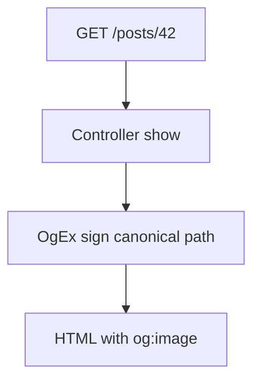
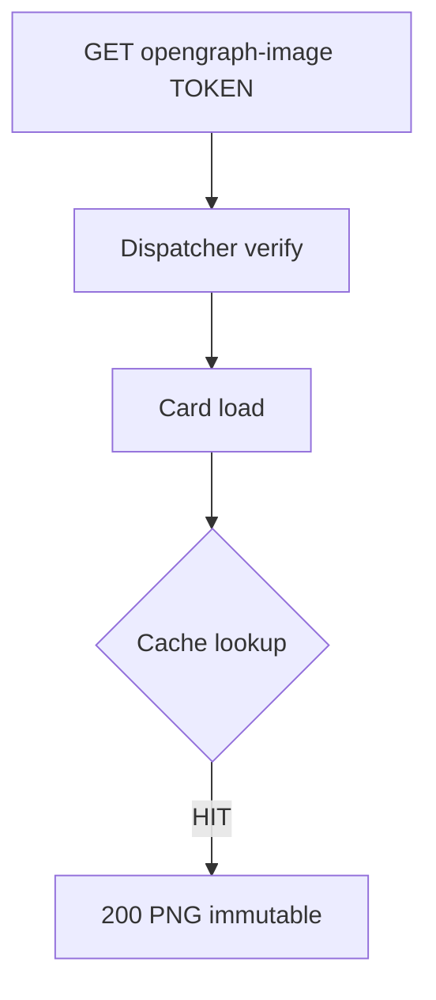
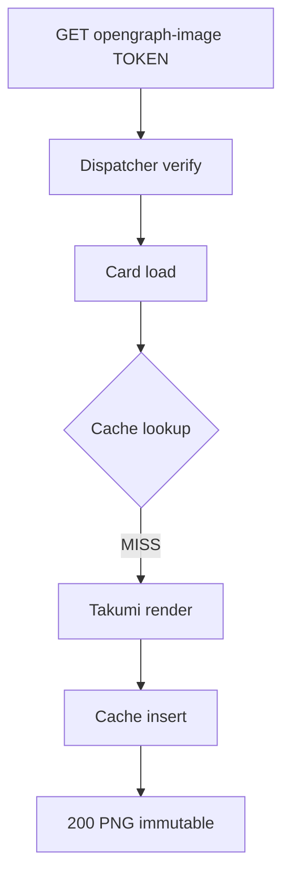
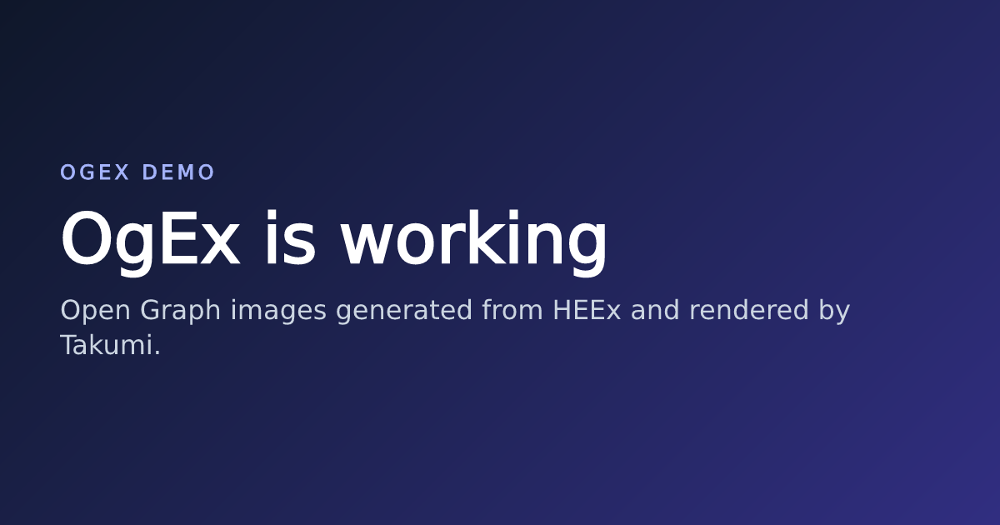
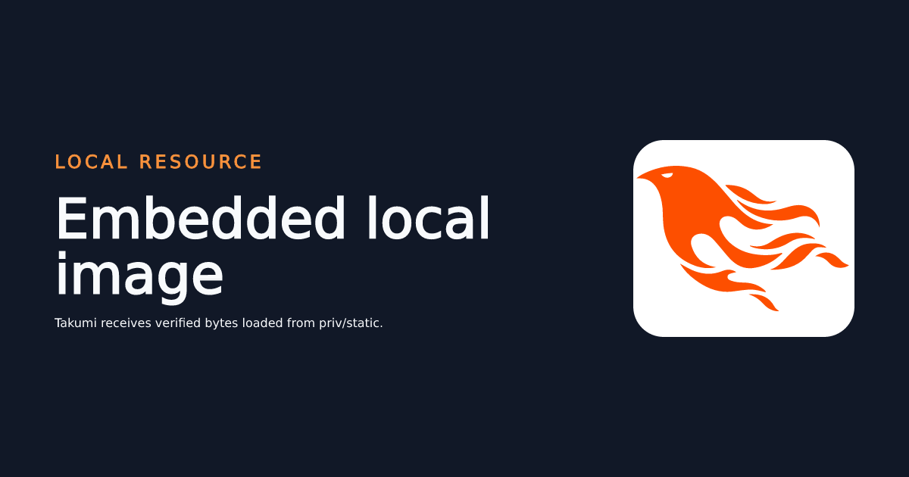

# OgEx

OgEx adds Open Graph and Twitter/X images to Phoenix controller responses.
Declare a card for an action, load only the data needed by its image, and write
the card with ordinary HEEx and CSS:

```elixir
og_card :show, MyAppWeb.PostOgCard
```

```elixir
def load(_conn, %{"id" => id}) do
  post = Blog.get_public_post!(id)
  {:ok, %{title: post.title, description: post.summary}}
end
```

Generated images are served from signed versions of the page URL. The image
request runs the card loader without running the normal page action.







## Release status

OgEx `0.3.1` is the current release. It fixes path-mode image dispatch for
root and trailing-slash pages, canonicalizes page-path signing, and accepts
lazy font configuration that never touches the filesystem during compilation
or release assembly. The `0.2.0` render declaration remains available as a
migration path.

OgEx is still a `0.x` package. Review release notes before upgrading because
minor releases may change public APIs.

## Requirements

- Elixir 1.17 or later.
- Phoenix 1.7 or later.
- At least one TTF, OTF, WOFF, or WOFF2 font.
- No Rust toolchain is required for supported release targets. OgEx downloads a
  precompiled native archive during dependency compilation.

## Installation

Add OgEx to `mix.exs`:

```elixir
def deps do
  [
    {:og_ex, "~> 0.3"}
  ]
end
```

Published versions select a checksum-verified archive for the host operating
system, CPU, and NIF ABI. See
[Native releases and publishing](docs/native-releases.md) for supported targets
and release details.

## Configure fonts

Takumi does not read system fonts. OgEx passes the configured font files to the
renderer on a cache miss. The recommended form resolves lazily against your
application and never touches the filesystem during compilation or release
assembly:

```elixir
# config/config.exs
import Config

config :og_ex,
  otp_app: :my_app,
  fonts: [
    {:ogex_font, "priv/fonts/Inter-Regular.ttf"},
    {:ogex_font, "priv/fonts/Inter-Bold.ttf"}
  ]
```

The `{:ogex_font, path}` entry is plain data, so evaluating your config never
requires OgEx to be compiled — including when Mix compiles dependencies.
`OgEx.font(path)` returns exactly that tuple and can be used anywhere OgEx is
already loaded, such as tests or `runtime.exs`. Relative paths resolve with
`Application.app_dir/2` against the configured `otp_app`; absolute paths pass
through unchanged.

The `:fonts` list also accepts:

- A plain binary: an existing file path is read, any other binary is treated as
  already-loaded font bytes.
- `{mod, fun, args}` or a zero-arity fun returning a path or font bytes,
  invoked when fonts load.

The font files must be available inside the deployed release. Keeping them in
your application's `priv/fonts` directory with a `{:ogex_font, ...}` marker
usually makes that straightforward. Rendering fails if no font is configured,
and an invalid entry shape or missing file produces a structured error: image
requests return a non-cacheable `503` and OgEx logs the exact reason once per
node.

## Enable a controller

Add `use OgEx.Controller` after the application's controller setup:

```elixir
defmodule MyAppWeb.PostController do
  use MyAppWeb, :controller
  use OgEx.Controller

  og_card :show, MyAppWeb.PostOgCard

  def show(conn, %{"id" => id}) do
    post = MyApp.Blog.get_post!(id)
    render(conn, :show, post: post)
  end
end
```

`og_card :show, PostOgCard` associates the card with `show/2`.
`OgEx.Controller` installs an early query-image plug and replaces the
controller-local `render/3` so the normal HTML response automatically receives
the card metadata. Actions without a declaration keep normal Phoenix behavior.

The default image URL strategy is `:path`. Choose exactly one path integration
for each Phoenix router.

### Recommended: router integration

Import `OgEx.Router` and call `og_ex_routes()` after every application route:

```elixir
defmodule MyAppWeb.Router do
  use MyAppWeb, :router
  import OgEx.Router

  scope "/", MyAppWeb do
    pipe_through :browser

    get "/posts/:id", PostController, :show
  end

  # Keep this after application routes and custom catch-alls.
  og_ex_routes()
end
```

Application routes take priority. The final OgEx route handles unmatched signed
paths such as:

```text
/posts/42/opengraph-image/SIGNED_TOKEN
/posts/42/twitter-image/SIGNED_TOKEN
```

### Alternative: endpoint integration

Applications that want interception before Phoenix routing can install OgEx
immediately before their router:

```elixir
defmodule MyAppWeb.Endpoint do
  use Phoenix.Endpoint, otp_app: :my_app

  # Existing endpoint plugs...

  plug OgEx, router: MyAppWeb.Router
  plug MyAppWeb.Router
end
```

The endpoint plug performs a cheap candidate check on every request. Signed
image requests are resolved through `MyAppWeb.Router`, loaded, rendered, and
halted before the router runs. Ordinary requests pass through unchanged.

Do not install both `og_ex_routes()` and the endpoint plug. OgEx logs a warning
when endpoint initialization can see that the configured router already
contains the OgEx route. If both remain installed, the endpoint plug receives
the request first.

### Choose path or query URLs

Set the application default:

```elixir
# config/config.exs
config :og_ex,
  image_route: :path
```

Or override one declaration:

```elixir
og_card :show, MyAppWeb.PostOgCard,
  image_route: :query
```

Query mode produces:

```text
/posts/42?__og_ex=SIGNED_TOKEN
```

`use OgEx.Controller` intercepts that request before `show/2` executes. Query
mode does not require `og_ex_routes()` or the endpoint plug. Installing the
endpoint integration also allows query requests to be intercepted before
Phoenix routing.

Precedence is the declaration's `image_route:`, then
`config :og_ex, :image_route`, then the built-in `:path` default.

### Image URL names

OgEx 0.3.0 reserves these URL names:

| Strategy | Reserved name |
| --- | --- |
| Query | `__og_ex` |
| Open Graph path | `opengraph-image` |
| Twitter/X path | `twitter-image` |

They are intentionally fixed in 0.3.0 and cannot be renamed through
configuration. Application code should treat them as OgEx-owned names and
should not use `__og_ex` for unrelated query data.

Changing the names requires coordinated changes to URL generation, endpoint
and router recognition, signature verification, and crawler-facing metadata;
changing only a router path will break image requests. Configurable names are
tracked as a future routing enhancement.

Declare an action only once. A controller cannot register both a path card and
a query card for the same action; OgEx raises a compile error instead of
silently choosing one. One declaration may still override the application
default, so different actions in the same controller can use different
strategies.

## Define a generated card

A card normally loads its image assigns and supplies metadata, a stable version,
and HEEx:

```elixir
defmodule MyAppWeb.PostOgCard do
  use OgEx.Card, width: 1200, height: 630, format: :png

  @impl OgEx.Card
  def load(_conn, %{"id" => id}) do
    case MyApp.Blog.get_public_post(id) do
      nil ->
        {:error, :not_found}

      post ->
        {:ok, %{post: post}}
    end
  end

  @impl OgEx.Card
  def metadata(%{post: post}) do
    %{
      title: post.title,
      description: post.summary,
      type: "article",
      image_alt: "Social card for #{post.title}",
      twitter_card: "summary_large_image"
    }
  end

  @impl OgEx.Card
  def version(%{post: post}) do
    {:post_card, 1, post.id, post.title, post.updated_at}
  end

  @impl OgEx.Card
  def render(assigns) do
    ~H"""
    <main class="card">
      <p class="site">ACME ENGINEERING</p>

      <section>
        <h1>{@post.title}</h1>
        <p class="author">By {@post.author.name}</p>
      </section>
    </main>

    <style>
      * {
        box-sizing: border-box;
      }

      .card {
        width: 100%;
        height: 100%;
        padding: 72px;
        display: flex;
        flex-direction: column;
        justify-content: space-between;
        color: white;
        background:
          radial-gradient(circle at top right, #4f46e5, transparent 45%),
          #0f172a;
        font-family: Inter, sans-serif;
      }

      .site {
        margin: 0;
        color: #a5b4fc;
        font-size: 24px;
        font-weight: 700;
        letter-spacing: 0.16em;
      }

      h1 {
        max-width: 1000px;
        margin: 0 0 24px;
        font-size: 72px;
        line-height: 1.05;
      }

      .author {
        margin: 0;
        color: #c7d2fe;
        font-size: 30px;
      }
    </style>
    """
  end
end
```

`load/2` runs only for the image request. The normal HTML request continues to
use the data loaded by `PostController.show/2`. Both paths must provide the
assigns used by `metadata/1`, `version/1`, and `render/1`.

The loader may return:

| Result | Image response |
| --- | --- |
| `{:ok, assigns}` | Render and cache the card |
| `{:error, :not_found}` | `404`, non-cacheable |
| `{:error, :forbidden}` | `404`, non-cacheable |
| `{:error, reason}` | `503`, non-cacheable |
| Exception, exit, throw, or invalid result | `503`, non-cacheable |

Social crawlers do not normally send the original browser session. Load only
data intended to be public, and return `{:error, :not_found}` for private
records when revealing their existence would be inappropriate.

### Override loading in the controller

Reusable presentation cards can omit `load/2`:

```elixir
og_card :show, MyAppWeb.SharedPostCard,
  load: &load_post_card/2

defp load_post_card(_conn, %{"id" => id}) do
  post = MyApp.Blog.get_public_post!(id)
  {:ok, %{post: post}}
end
```

An explicit declaration loader takes precedence over `Card.load/2`.

When one card serves several declarations, inspect the trusted originating
route through:

```elixir
OgEx.controller(conn)
OgEx.action(conn)
OgEx.route_params(conn)
OgEx.image_role(conn)
```

Do not depend on `conn.private.phoenix_action` for this purpose. A path-mode
request is initially handled by OgEx rather than the page controller.

The controller and card above produce this 1200 × 630 PNG:



`use OgEx.Card` imports `Phoenix.Component`, so the module can use `~H`,
function components, and normal HEEx escaping.

The dimensions in `use OgEx.Card` are the renderer viewport. The wrapper added
by OgEx fills that viewport, so the card's outer element should normally use
`width: 100%` and `height: 100%`.

## Legacy 0.2.0 render declarations

OgEx `0.2.0` selects cards inside `render/3`:

```elixir
def show(conn, %{"id" => id}) do
  post = MyApp.Blog.get_post!(id)

  render(conn, :show,
    post: post,
    og: MyAppWeb.PostOgCard
  )
end
```

That API remains compatible during the `0.3.0` migration. Its signed query
request runs the controller action until the action reaches `render/3`, so page
loading and image loading cannot differ. New declarations solve that problem by
dispatching `Card.load/2` before the action:

```elixir
og_card :show, MyAppWeb.PostOgCard
```

Direct existing-image metadata continues to use `render(..., og: metadata)`:

```elixir
render(conn, :about,
  og: [
    title: "About Acme",
    image: "/images/about-og.png"
  ]
)
```

The declaration DSL currently applies to generated cards.

### Metadata fields

`metadata/1` returns a map with:

| Field | Required | Default |
| --- | --- | --- |
| `:title` | yes | none |
| `:description` | no | omitted |
| `:type` | no | `"website"` |
| `:image_alt` | no | omitted |
| `:twitter_card` | no | `"summary_large_image"` |

Dynamic metadata is escaped before it is inserted into the page.

### Version generated images

`version/1` should return the smallest stable term that changes whenever the
rendered image changes. A useful convention is to start with a descriptive
card name and an integer layout revision:

```elixir
@layout_revision 1

@impl OgEx.Card
def version(%{post: post}) do
  {:post_card, @layout_revision, post.id, post.updated_at}
end
```

OgEx hashes this term. It does not place the original value in the public URL.
The hash contributes to the request signature, ETag, and generated-image cache
key. `:post_card` is only a label chosen by the application, and
`@layout_revision` is only a cache-busting number. Neither value is the OgEx
package version or the image URL strategy.

If `version/1` is omitted, OgEx hashes the complete assigns map. That is useful
while developing a card but can create avoidable cache entries when assigns
contain values that do not affect the image.

Card code, HEEx, and CSS are not automatically part of the returned term.
Increase the layout revision when a presentation-only change must produce a new
immutable URL:

```elixir
@layout_revision 2

def version(%{post: post}) do
  {:post_card, @layout_revision, post.id, post.updated_at}
end
```

## Add images to generated cards

OgEx reads `` values after evaluating the card's HEEx. Each source is
normalized, loaded, inspected, and registered with Takumi under the exact
string used in the HTML. Takumi does not receive filesystem or unrestricted
network access.

The current scanner handles ``. It does not yet discover CSS
`url(...)`, `srcset`, or `<picture>` sources.

### Public Phoenix assets

Use a root-relative path:

```heex

```

OgEx resolves the file under the endpoint application's `priv/static`
directory. It rejects traversal and symlinks before reading the file.

#### Example: embed a local image

The `v0_2_0` demo keeps `logo.svg` at
`priv/static/images/logo.svg`. Its controller selects a normal generated card:

```elixir
def embedded_local(conn, _params) do
  render(conn, :home,
    title: "Embedded local image",
    description: "Takumi receives verified bytes loaded from priv/static.",
    og: MyAppWeb.LocalImageOgCard
  )
end
```

The card uses the public path in ordinary HEEx:

```elixir
defmodule MyAppWeb.LocalImageOgCard do
  use OgEx.Card, width: 1200, height: 630, format: :png

  @impl OgEx.Card
  def metadata(assigns) do
    %{
      title: assigns.title,
      description: assigns.description,
      image_alt: "Local image demo"
    }
  end

  @impl OgEx.Card
  def version(assigns), do: {assigns.title, assigns.description}

  @impl OgEx.Card
  def render(assigns) do
    ~H"""
    <main class="card">
      <section>
        <p class="eyebrow">LOCAL RESOURCE</p>
        <h1>{@title}</h1>
        <p>{@description}</p>
      </section>

      <div class="image-shell">
        
      </div>
    </main>

    <style>
      .card {
        width: 100%;
        height: 100%;
        padding: 72px;
        display: flex;
        align-items: center;
        justify-content: space-between;
        color: #f8fafc;
        background: #111827;
        font-family: "DejaVu Sans", sans-serif;
      }

      .image-shell {
        width: 300px;
        height: 260px;
        display: flex;
        align-items: center;
        justify-content: center;
        border-radius: 40px;
        background: white;
      }

      img {
        width: 284px;
        height: 192px;
        object-fit: contain;
      }
    </style>
    """
  end
end
```

OgEx reads and verifies `logo.svg` on the signed image request, registers its
bytes with Takumi, and includes the file fingerprint in the generated-image
cache key. The embedded file's intrinsic size does not set the final card size;
`use OgEx.Card` sets the output to 1200 × 630.

Actual response from the demo:



### Private application files

Private files are not served by `Plug.Static`. Configure their root:

```elixir
# config/config.exs
config :og_ex,
  private_asset_root: "priv/og_ex"
```

Then use `OgEx.private_asset/1` in HEEx:

```heex

```

Relative roots are resolved inside the host OTP application. If OgEx cannot
determine that application from the Phoenix endpoint, set it explicitly:

```elixir
config :og_ex, otp_app: :my_app
```

The helper returns an opaque source string. It does not expose the filesystem
path in the rendered image or grant Takumi filesystem access.

### External HTTPS images

Use an ordinary URL in the card:

```heex

```

Remote loading is disabled until it is configured:

```elixir
# config/runtime.exs
config :og_ex,
  remote_images: [
    enabled: true,
    allowed_hosts: ["cdn.example.com", "*.cloudfront.net"]
  ]
```

The request occurs when the signed image URL is requested, not while Phoenix
renders the HTML page. See [Remote image configuration](#remote-image-configuration)
for the complete policy.

#### Example: embed an external image

The demo uses an image pinned to the `v0.2.0` repository tag:

```elixir
@external_image_url "https://raw.githubusercontent.com/obasekiosa/og_ex/v0.2.0/artifacts/og_ex-preview.png"
```

Only its host is allowed:

```elixir
config :og_ex,
  remote_images: [
    enabled: true,
    allowed_hosts: ["raw.githubusercontent.com"]
  ]
```

The controller passes the URL as a normal card assign:

```elixir
def embedded_external(conn, _params) do
  render(conn, :home,
    title: "Embedded external image",
    description: "OgEx validates, downloads, caches, and registers the remote image.",
    external_image_url: @external_image_url,
    og: MyAppWeb.ExternalImageOgCard
  )
end
```

The card uses that assign in HEEx:

```elixir
defmodule MyAppWeb.ExternalImageOgCard do
  use OgEx.Card, width: 1200, height: 630, format: :png

  @impl OgEx.Card
  def metadata(assigns) do
    %{
      title: assigns.title,
      description: assigns.description,
      image_alt: "External image demo"
    }
  end

  @impl OgEx.Card
  def version(assigns) do
    {:uncropped_v2, assigns.title, assigns.external_image_url}
  end

  @impl OgEx.Card
  def render(assigns) do
    ~H"""
    <main class="card">
      <div class="image-shell">
        
      </div>

      <section>
        <p class="eyebrow">REMOTE RESOURCE</p>
        <h1>{@title}</h1>
        <p>{@description}</p>
      </section>
    </main>

    <style>
      .card {
        width: 100%;
        height: 100%;
        padding: 64px;
        display: flex;
        align-items: center;
        gap: 48px;
        color: #ecfeff;
        background: linear-gradient(135deg, #082f49, #164e63);
        font-family: "DejaVu Sans", sans-serif;
      }

      .image-shell {
        width: 560px;
        height: 360px;
        display: flex;
        align-items: center;
        justify-content: center;
        border-radius: 30px;
        background: #172554;
        overflow: hidden;
      }

      img {
        width: 560px;
        height: 330px;
        object-fit: contain;
      }
    </style>
    """
  end
end
```

`object-fit: contain` preserves the complete external source. OgEx fetches it
only for the signed image request and applies the configured host, address,
redirect, timeout, byte, media-type, and image-content checks before Takumi
receives the bytes.

Actual response from the demo:


### Data URLs

Generated cards accept base64 image data URLs:

```heex
 @encoded_logo} />
```

Data URLs count against the same byte and decoded-dimension limits as other
resources. They increase the data hashed and passed through the renderer, so a
public or private file is usually preferable.

## Use an existing image directly

Use direct metadata when the social image is already encoded and does not need
Takumi. Pass a keyword list or map as `:og`.

### Public static image

```elixir
def about(conn, _params) do
  render(conn, :about,
    og: [
      title: "About Acme",
      description: "Meet the team",
      image: "/images/about-og.png",
      image_alt: "The Acme team"
    ]
  )
end
```

OgEx verifies the local file, reads its dimensions, and emits the absolute URL
returned by the endpoint's static path handling. `Plug.Static` serves the image;
Takumi and the generated-image cache are not involved.

#### Example: use a public file as `og:image`

The demo points directly to the same Phoenix logo used by the embedded-local
card:

```elixir
def direct_image(conn, _params) do
  render(conn, :home,
    title: "Direct existing image",
    description: "The metadata points to Plug.Static; Takumi is not invoked.",
    og: [
      title: "Direct existing OgEx image",
      description: "This og:image is the existing local logo.svg file.",
      image: "/images/logo.svg",
      image_alt: "Phoenix flame logo"
    ]
  )
end
```

The page's `og:image` is the absolute `/images/logo.svg` URL. There is no OgEx
signature, image render, or generated-image cache lookup. The response is the
original SVG:


### Private existing image

```elixir
def report(conn, %{"id" => id}) do
  report = MyApp.Reports.get!(id)

  render(conn, :show,
    report: report,
    og: [
      title: report.title,
      image: {:private, "reports/default-og.png"}
    ]
  )
end
```

OgEx verifies the file during the HTML request and emits a signed URL for the
same controller route. A request with a valid signature returns the original
encoded bytes; the image is not passed through Takumi.

Private means “not served by `Plug.Static`.” Social crawlers still need public
network access to the signed URL. OgEx does not use the visitor's authenticated
session as an authorization mechanism for crawler access.

### External existing image

```elixir
def show(conn, %{"id" => id}) do
  post = MyApp.Blog.get_post!(id)

  render(conn, :show,
    post: post,
    og: [
      title: post.title,
      description: post.summary,
      image: post.cover_url,
      image_width: 1200,
      image_height: 630
    ]
  )
end
```

OgEx writes the external URL into the metadata without requesting it. Explicit
dimensions are optional. When omitted, the corresponding metadata tags are
omitted because OgEx does not download a direct external image to inspect it.

The remote-image allowlist applies to images embedded in generated cards. It
does not restrict direct external metadata URLs because OgEx does not fetch
them.

### Separate Twitter/X image

`:image` is used for both Open Graph and Twitter/X unless
`:twitter_image` is present:

```elixir
render(conn, :release,
  og: [
    title: "Acme 2.0",
    image: "/images/release-wide.png",
    twitter_image: "/images/release-square.png",
    twitter_card: "summary"
  ]
)
```

Public, private, and external source forms are accepted for
`:twitter_image`.

### Direct-image dimensions and resizing

OgEx does not resize an existing direct image.

- For a public or private local image, OgEx inspects the file and writes its
  intrinsic width and height into the Open Graph metadata.
- A private direct response returns the original encoded bytes unchanged.
- A public direct image is served unchanged by `Plug.Static`.
- For an external direct image, OgEx does not fetch the URL. It writes
  `:image_width` and `:image_height` only when those values are supplied.

The `1200 × 630` size commonly used for large Open Graph cards is a convention,
not a transformation currently applied to direct images. If a source must be
exactly `1200 × 630`, prepare it at that size or use a generated card whose
viewport is configured to those dimensions.

## Generated request lifecycle

For a normal page request:

```text
GET /posts/42
  → the controller loads its normal data
  → OgEx evaluates metadata and builds a signed image URL
  → Phoenix renders the page and root layout
  → OgEx inserts meta tags before </head>
```

In the default path mode, generated metadata points to:

```text
GET /posts/42/opengraph-image/4K7fQxRfj2p0DqX_WLAzTA
GET /posts/42/twitter-image/ANOTHER_SIGNED_TOKEN
```

For that image request:

```text
GET /posts/42/opengraph-image/...
  → the router or endpoint integration resolves PostController.show
  → the normal controller action is skipped
  → PostOgCard.load/2 loads image-specific assigns
  → the signature is verified against the route, card, role, and version
  → card HEEx is evaluated
  → referenced images are loaded and fingerprinted
  → the final-image cache is checked
  → Takumi renders on a cache miss
  → the encoded image is returned
```

In query mode, the URL uses:

```text
GET /posts/42?__og_ex=4K7fQxRfj2p0DqX_WLAzTA
```

The controller integration halts from its early plug before `show/2`. With
endpoint integration, OgEx can halt even before Phoenix routing.

Both strategies retain unrelated query parameters, such as a locale, while
replacing any older `__og_ex` value. Only the loader and card rendering
lifecycle runs for a declaration-based image request.

Legacy `render(..., og: Card)` requests retain the `0.2.0` behavior: the action
runs until it reaches `render/3`, but the Phoenix page template is skipped.

## Head injection

OgEx inserts metadata when Phoenix sends a complete HTML response. The response
must contain a closing `</head>` element. Streaming and compressed HTML bodies
are not rewritten.

The generated tags include:

```html
<meta property="og:title" content="...">
<meta property="og:description" content="...">
<meta property="og:type" content="website">
<meta property="og:image" content="...">
<meta property="og:image:width" content="1200">
<meta property="og:image:height" content="630">
<meta property="og:image:alt" content="...">
<meta name="twitter:card" content="summary_large_image">
<meta name="twitter:title" content="...">
<meta name="twitter:description" content="...">
<meta name="twitter:image" content="...">
<meta name="twitter:image:alt" content="...">
```

Optional tags are omitted when their values are absent.

## Output formats

Generated cards support:

| Format | Card option | Response type |
| --- | --- | --- |
| PNG | `:png` | `image/png` |
| JPEG | `:jpeg` | `image/jpeg` |
| WebP | `:webp` | `image/webp` |
| SVG | `:svg` | `image/svg+xml` |

```elixir
use OgEx.Card, width: 1200, height: 630, format: :webp
```

PNG is the default and the safest choice for broad crawler compatibility.
Support for SVG previews varies by platform.

Takumi's SVG output contains vector layout and glyph paths. Bitmap resources
remain bitmap content inside the SVG.

Direct local resources may be PNG, JPEG, WebP, GIF, or SVG. OgEx detects the
type from the file contents rather than trusting the extension.

### Output gallery

These files are actual responses from the companion controller examples.

<details>
<summary>Show generated card examples</summary>

#### Wide PNG — 1200 × 630

```elixir
use OgEx.Card, width: 1200, height: 630, format: :png
```


#### Square PNG — 600 × 600

```elixir
use OgEx.Card, width: 600, height: 600, format: :png
```

Pair a square image with compact Twitter/X metadata when appropriate:

```elixir
def metadata(assigns) do
  %{title: assigns.title, twitter_card: "summary"}
end
```


#### Wide SVG — 1200 × 630

```elixir
use OgEx.Card, width: 1200, height: 630, format: :svg
```


#### Square SVG — 600 × 600

```elixir
use OgEx.Card, width: 600, height: 600, format: :svg
```


#### Endpoint integration with a path URL — 1200 × 630

This response comes from the separate `f_endpoint` demo. The OgEx endpoint
plug intercepts the signed path before the Phoenix router or page action runs.


#### Endpoint integration with a query URL — 1200 × 630

This second card uses a separate declaration and loader. The loader does not
inspect the route strategy or match on the controller action.


</details>

## Remote image configuration

The default remote loader is opt-in and deny-by-default:

```elixir
config :og_ex,
  remote_images: [
    enabled: true,
    allowed_hosts: ["cdn.example.com", "*.cloudfront.net"],
    max_bytes: 5_000_000,
    max_dimension: 8_192,
    max_pixels: 40_000_000,
    connect_timeout: 2_000,
    receive_timeout: 5_000,
    request_timeout: 8_000,
    max_redirects: 2,
    cache_ttl: 300_000
  ],
  resource_cache: [
    max_entries: 128,
    max_bytes: 25_000_000
  ]
```

Defaults:

| Option | Default | Meaning |
| --- | ---: | --- |
| `:enabled` | `false` | Enables external resources inside generated cards |
| `:allowed_hosts` | `[]` | Exact hosts or `*.` subdomain patterns |
| `:allow_http` | `false` | Allows plain HTTP when explicitly enabled |
| `:max_bytes` | `5_000_000` | Maximum encoded resource size |
| `:max_dimension` | `8_192` | Maximum width or height |
| `:max_pixels` | `40_000_000` | Maximum decoded pixel count |
| `:connect_timeout` | `2_000` | TCP/TLS connection timeout in milliseconds |
| `:receive_timeout` | `5_000` | Socket receive timeout in milliseconds |
| `:request_timeout` | `8_000` | Total request timeout in milliseconds |
| `:max_redirects` | `2` | Redirects validated before the request fails |
| `:cache_ttl` | `300_000` | Fresh remote-resource lifetime in milliseconds |

The loader:

- permits HTTPS by default;
- validates every redirect target;
- resolves every DNS answer and rejects the host if any answer is unsafe;
- rejects loopback, private, link-local, multicast, unspecified, reserved, and
  cloud metadata addresses;
- connects to a validated address while retaining the original TLS hostname;
- does not forward page cookies, authorization, or request headers;
- stops streaming when the byte limit is crossed;
- checks the response media type and then verifies the image bytes;
- retains ETag and Last-Modified validators for conditional requests;
- does not cache failed or partial responses.

To allow every hostname:

```elixir
config :og_ex,
  remote_images: [
    enabled: true,
    allowed_hosts: ["*"]
  ]
```

OgEx logs a warning once when the application starts. `"*"` disables only the
hostname allowlist; address validation and all other limits still apply.

Prefer explicit hosts in production.

### SVG resources

Before SVG bytes reach Takumi, the default loader rejects scripts, event
handlers, `foreignObject`, external `href` or `src` references, and external
CSS `url(...)` references. SVG dimensions and byte size are subject to the
normal limits.

## Caching

OgEx maintains two in-memory caches.

### Generated-image cache

The default `OgEx.Cache.ETS` stores final encoded cards. Its key contains:

```elixir
{
  card_module,
  card_version,
  width,
  height,
  format,
  sorted_resource_fingerprints
}
```

Changing a referenced local image changes its fingerprint and therefore the
final cache key.

Only successful renders are stored. The default cache is local to one BEAM node
and has no persistence or eviction policy. Simultaneous misses for the same key
are not coalesced.

Replace it with a module implementing `OgEx.Cache`:

```elixir
defmodule MyApp.OgImageCache do
  @behaviour OgEx.Cache

  @impl true
  def fetch(key) do
    case MyApp.Cache.get(key) do
      nil -> :error
      image when is_binary(image) -> {:ok, image}
    end
  end

  @impl true
  def put(key, image) do
    MyApp.Cache.put(key, image)
    :ok
  end
end

config :og_ex, cache: MyApp.OgImageCache
```

`fetch/1` follows `Map.fetch/2`: it returns `{:ok, image}` or `:error`.

### Remote-resource cache

`OgEx.ResourceCache` stores verified remote bytes and HTTP validators. It is
bounded by entry count and total byte size:

```elixir
config :og_ex,
  resource_cache: [
    max_entries: 128,
    max_bytes: 25_000_000
  ]
```

When an insertion would exceed a bound, the current implementation clears the
table before inserting the new resource. It is an in-memory, per-node cache.

### Response caching

Successful generated and signed private responses include:

```http
Cache-Control: public, max-age=31536000, immutable
ETag: "CONTENT_IDENTITY"
```

Render failures use `Cache-Control: no-store`.

## Error behavior

Current behavior is intentionally documented here because the failure boundary
depends on the image source:

| Source | HTML request | Image request |
| --- | --- | --- |
| Resource embedded in a generated card | HTML normally returns `200` | Resource or render failure returns an empty, non-cacheable `503` |
| Direct external image | URL is emitted without a fetch | The social platform fetches the external URL |
| Direct public image | File is verified while metadata is built | `Plug.Static` serves the URL |
| Direct private image | File is verified while metadata is built | Valid signed request returns the original bytes |

An invalid image signature returns an empty `404`.

A missing or invalid direct local image currently raises while the HTML
metadata is built and can make the page return `500`. Lazy direct verification
and configurable fallback images are designed in `todo/image_plan.md` but are not
implemented in this version.

OgEx never caches a failed generated render.

## Telemetry

OgEx emits:

| Event | Measurements | Metadata |
| --- | --- | --- |
| `[:og_ex, :resource, :stop]` | `:duration`, optional `:size` | `:source_type`, `:status`, `:loader` |
| `[:og_ex, :cache, :hit]` | none | `:card` |
| `[:og_ex, :cache, :miss]` | none | `:card` |
| `[:og_ex, :render, :stop]` | `:duration`, `:size` | `:card`, `:renderer` |
| `[:og_ex, :render, :exception]` | `:system_time` | `:card`, `:reason` |
| `[:og_ex, :signature, :legacy]` | none | `:page_path`, `:canonical` |

Durations use native telemetry time units. Convert them with
`System.convert_time_unit/3` in a handler.

## Replace the resource loader

Use a custom `OgEx.ResourceLoader` for authenticated object storage, fixtures,
or an application-specific network policy:

```elixir
defmodule MyApp.OgResourceLoader do
  @behaviour OgEx.ResourceLoader

  @impl true
  def load(%OgEx.Image.Source{type: :remote} = source, _options) do
    with {:ok, bytes} <- MyApp.Media.fetch(source.reference) do
      OgEx.ResourceLoader.Default.from_bytes(source, bytes)
    end
  end

  def load(source, options) do
    OgEx.ResourceLoader.Default.load(source, options)
  end
end

config :og_ex, resource_loader: MyApp.OgResourceLoader
```

Return `{:ok, %OgEx.Image.Resource{}}` only after the bytes have been verified.
`OgEx.ResourceLoader.Default.from_bytes/2` applies the package's native image,
dimension, and SVG checks.

## Replace the renderer

The default renderer is `OgEx.Renderer.Takumi`:

```elixir
config :og_ex, renderer: OgEx.Renderer.Takumi
```

Custom renderers implement `OgEx.Renderer` and return an encoded image, not raw
pixels:

```elixir
defmodule MyApp.OgRenderer do
  @behaviour OgEx.Renderer

  @impl true
  def render(html, options) do
    width = Keyword.fetch!(options, :width)
    height = Keyword.fetch!(options, :height)
    format = Keyword.fetch!(options, :format)
    images = Keyword.get(options, :images, %{})

    MyRenderer.render(html,
      width: width,
      height: height,
      format: format,
      images: images
    )
  end
end
```

The callback must return `{:ok, encoded_binary}` or `{:error, reason}`.

## Testing locally

Request the page, extract its `og:image`, then request that URL:

```bash
curl -s http://localhost:4000/posts/42 |
  grep 'property="og:image"'
```

The URL is absolute. Opening it in a browser is often the quickest way to
inspect the generated card.

For automated controller tests, request the page, parse the metadata URL, and
make a second request with `Phoenix.ConnTest`. The package's integration tests
under `test/og_ex/` demonstrate the complete lifecycle.

The companion
[`og_ex_demo`](https://github.com/obasekiosa/og_ex_demo) repository contains
independent Phoenix example projects:

- [`apps/v0_1_0`](https://github.com/obasekiosa/og_ex_demo/tree/master/apps/v0_1_0)
  uses the published `0.1.0` API and includes wide, square, PNG, and SVG cards.
- [`apps/v0_2_0`](https://github.com/obasekiosa/og_ex_demo/tree/master/apps/v0_2_0)
  uses published `0.2.0` image sources: embedded local and external images,
  plus a direct static image.
- [`apps/v0_3_0`](https://github.com/obasekiosa/og_ex_demo/tree/master/apps/v0_3_0)
  exercises the controller DSL, card-local loading, and both path and query
  image URLs from the development branch.

## Current limitations

- Legacy `render(..., og: ...)` declarations run the controller action before
  recognizing an image request. Controller DSL declarations do not.
- Direct local files are verified during the HTML request.
- `` is the only discovered generated-card image reference.
- Streaming and compressed HTML responses are not rewritten.
- The default caches are in-memory and local to one BEAM node.
- Simultaneous generated-image cache misses are not coalesced.
- Takumi implements HTML and CSS layout but is not Chromium; unsupported CSS
  may render differently from a browser.
- Social-platform support for SVG metadata images is inconsistent.
- Dedicated image routes and static generated files are planned but not part of
  the current controller API.

## Development

```bash
mix deps.get
OG_EX_BUILD=1 mix test
cargo test --manifest-path native/og_ex_native/Cargo.toml
mix docs
mix hex.build
```

The native integration tests render real images and verify their formats and
dimensions.

Benchmarks: [BENCHMARKS.md](BENCHMARKS.md) records the 0.3.0 baseline and how
to reproduce it with the scripts under `bench/`.

See [Public API reference](docs/function-reference.md) for callbacks,
configuration boundaries, and extension points.

### Developing OgEx from source

Path dependencies and unreleased versions do not have matching GitHub release
archives:

```elixir
def deps do
  [
    {:og_ex, path: "../og-ex"}
  ]
end
```

Force a local native build on the first command that compiles OgEx:

```bash
OG_EX_BUILD=1 mix deps.compile og_ex --force
OG_EX_BUILD=1 mix test
```

Source builds require the Rust version pinned in `rust-toolchain.toml`. Native
release maintenance is documented in
[Native releases and publishing](docs/native-releases.md).

## License

OgEx is released under the MIT License.
